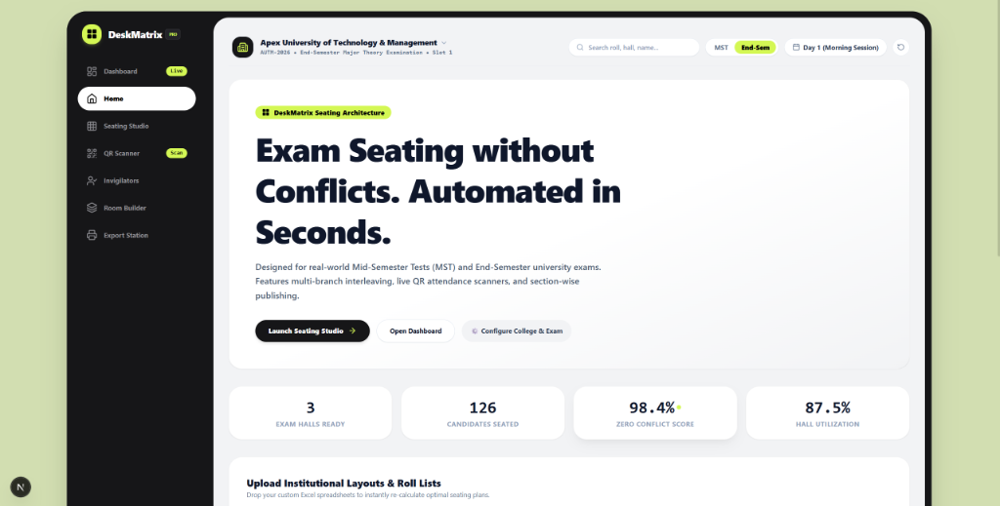
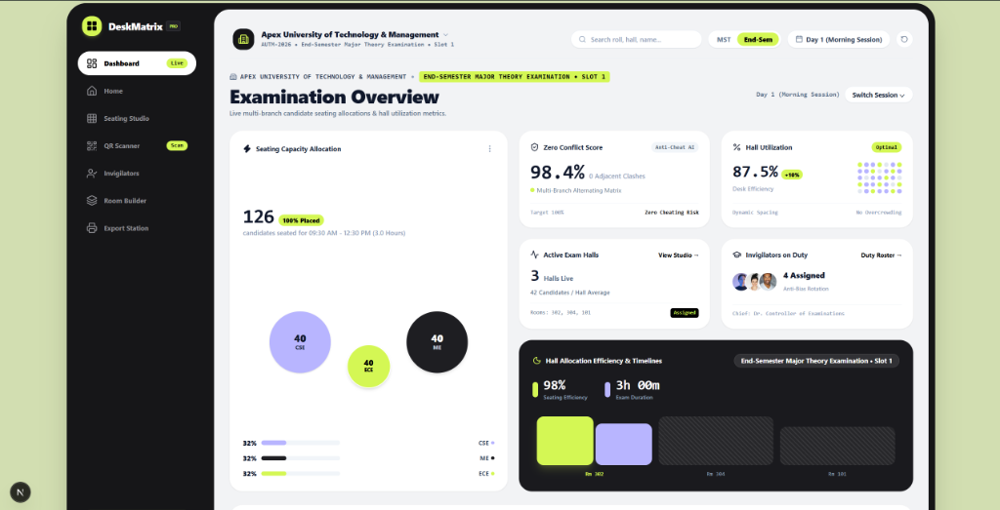
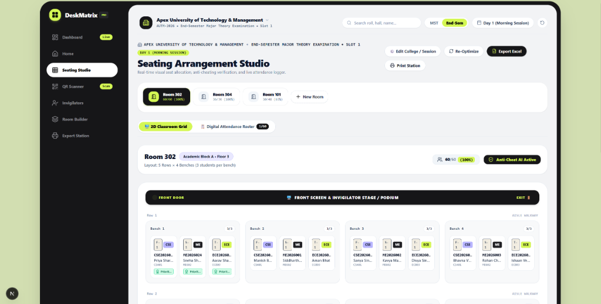
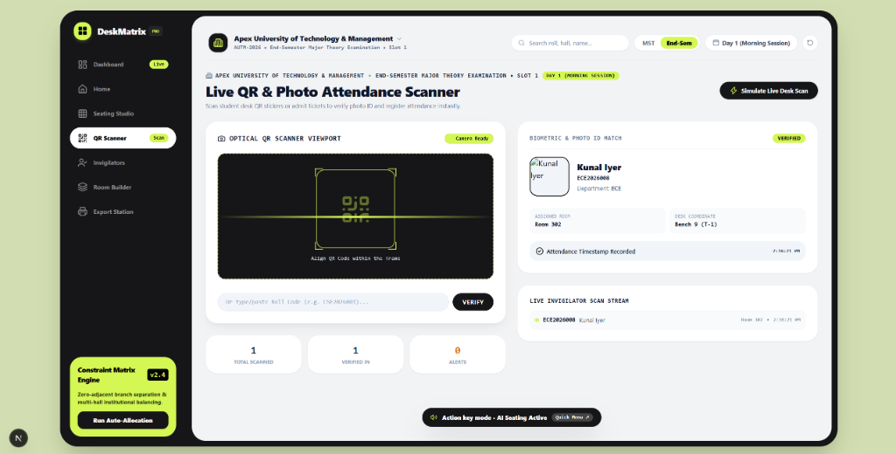
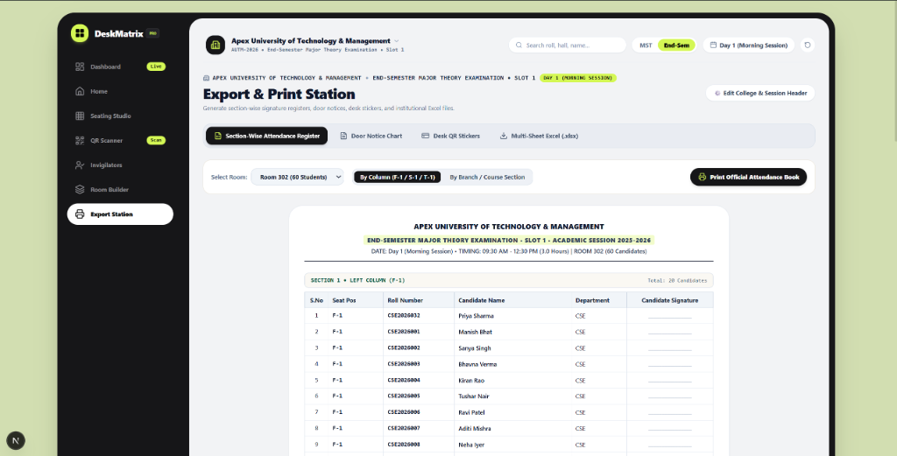

# 🏛️ DeskMatrix™ — Enterprise Exam Seating & Attendance Matrix System

<div align="center">



[](https://nextjs.org/)
[](https://react.dev/)
[](https://python.org/)
[](https://fastapi.tiangolo.com/)
[](https://tailwindcss.com/)
[](./LICENSE)

**An enterprise-grade, institutional examination arrangement suite designed for Mid-Semester Tests (MST) and End-Semester University Examinations.**  
*Automated Zero-Conflict Branch Interleaving • 2D Interactive Seating Studio • Live Optical QR & Photo ID Attendance • Section-Wise Print & Multi-Sheet Excel Engine*

</div>

---

## 📸 System Showcase & Visual Interface

### 1. 📊 Live Examination Overview Dashboard
*Real-time multi-branch capacity tracking, zero-conflict anti-cheat verification score, hall utilization matrix, and invigilator duty rosters.*


---

### 2. 🪑 Interactive 2D Seating Studio
*2D classroom bench matrix with multi-branch color pills (F-1 CSE, S-1 ME, T-1 ECE), live drag-less seat reallocation, and digital attendance logger.*


---

### 3. 📷 Optical QR & Photo ID Attendance Scanner
*Camera HUD viewport with candidate face ID match, seat coordinate lookup, and real-time invigilator attendance feed.*


---

### 4. 🖨️ Section-Wise Export & Official Print Station
*Generates column-wise & section-wise attendance signature registers, A4 door notice charts, desk QR stickers, and multi-sheet institutional `.xlsx` files.*


---

### 5. ⚡ Landing & Architecture Hub
*Switch between Mid-Semester Tests (MST) and End-Semester Major Theory Exams, configure college headers, and upload custom roll lists.*


---

## 🔌 Connecting Next.js Frontend with Python Backend

DeskMatrix features a **hybrid enterprise architecture**:
1. **Next.js 16 (App Router + React 19)**: Delivers a zero-latency Neo-Bento UI, live 2D seating manipulation, camera optical scanning, and offline-capable student lookup.
2. **Python Backend (FastAPI / Django + openpyxl + Pandas)**: Handles heavy mathematical branch interleaving, institutional database synchronization, and multi-sheet Excel generation.

```
 ┌────────────────────────────────────────────────────────┐
 │            Next.js Frontend (Port 3000)                │
 │   • Interactive 2D Studio    • Camera QR Scanner       │
 │   • Live Bento Dashboard     • Section Print Engine    │
 └─────────────────────────┬──────────────────────────────┘
                           │  HTTP / REST JSON (CORS)
                           ▼
 ┌────────────────────────────────────────────────────────┐
 │           Python FastAPI Backend (Port 8000)           │
 │   • POST /api/seating/generate   • POST /api/attendance│
 │   • POST /api/export/excel       • GET  /api/health    │
 └─────────────┬───────────────────────────┬──────────────┘
               │                           │
               ▼                           ▼
 ┌───────────────────────────┐   ┌────────────────────────┐
 │ openpyxl & Pandas Engine  │   │  SQLite / PostgreSQL   │
 │ Multi-Sheet Excel Reports │   │  Exam & Student Store  │
 └───────────────────────────┘   └────────────────────────┘
```

### 🛠️ Step-by-Step Connection Guide

#### 1. Configure Environment Variable in Next.js
In `web/.env.local`:
```env
NEXT_PUBLIC_PYTHON_BACKEND_URL=http://127.0.0.1:8000
```

#### 2. Frontend API Client (`web/lib/api.ts`)
The frontend communicates with Python via standard REST requests:
```typescript
import { requestPythonSeatingOptimization, verifyScanWithPython } from "@/lib/api";

// 1. Send Room Layout & Roll Numbers to Python Optimizer
const result = await requestPythonSeatingOptimization({
  rooms: roomConfigs,
  students: candidateList,
  examMode: "END_SEM",
  examSession: "Day 1 (Morning Session)"
});

// 2. Verify Scanned QR Admit Code with Python
const scanMatch = await verifyScanWithPython("CSE2026001", "Room 302");
console.log(scanMatch.seatCoordinate); // "Bench 1 (F-1)"
```

#### 3. Python FastAPI Server (`api_server.py`)
Start the Python backend with CORS support:
```python
from fastapi import FastAPI
from fastapi.middleware.cors import CORSMiddleware

app = FastAPI(title="DeskMatrix API")

# Enable Cross-Origin Resource Sharing for Next.js
app.add_middleware(
    CORSMiddleware,
    allow_origins=["http://localhost:3000", "http://127.0.0.1:3000"],
    allow_credentials=True,
    allow_methods=["*"],
    allow_headers=["*"],
)

@app.post("/api/seating/generate")
def generate_seating(payload: dict):
    # Runs multi-branch alternating matrix algorithm
    return {"success": True, "rooms": allocated_rooms}
```

---

## 🧠 Core Algorithms & Features

### 1. Zero-Conflict Alternating Branch Interleaving
- Automatically alternates students across benches so no two students from the same branch/subject sit directly adjacent:
  - **Seat F-1 (Left)**: Computer Science & Engineering (`CSE`)
  - **Seat S-1 (Middle)**: Mechanical Engineering (`ME`)
  - **Seat T-1 (Right)**: Electronics & Communication (`ECE`)

### 2. Section-Wise Signature Register Generation
- Groups attendance sheets by seating column (`F-1`, `S-1`, `T-1`) and academic branch section.
- Prepares official invigilator signature books with serial numbers, candidate roll codes, subject names, and signature blocks.

### 3. Optical QR Scanner & Instant ID Verification
- Uses the device camera or USB barcode scanner to decode admit card QR codes.
- Instantly displays assigned room, desk coordinate (`Bench 9 • T-1`), candidate photo, and registers live entry timestamp.

### 4. Customizable Room Geometry Builder
- Create classrooms of any dimension (e.g., 5 Rows × 4 Benches with 1 to 4 students per bench).
- Mark individual seats as defective or reserved for special-need candidates.

---

## 📁 Input File Requirements (Excel)

You can upload existing institutional spreadsheets:

### 1. Room Layout File (`Room_Layout.xlsx`)
| Room Number | Number of Rows | Number of Bench | Number of Student per Bench | Left Name | Middle Name | Right Name |
| :--- | :--- | :--- | :--- | :--- | :--- | :--- |
| **302** | 5 | 4 | 3 | CSE | ME | ECE |
| **304** | 6 | 3 | 2 | CSE | ME | - |

### 2. Roll Number Lists (`Left.xlsx`, `Middle.xlsx`, `Right.xlsx`)
| Roll Number | Candidate Name | Branch | Subject Code |
| :--- | :--- | :--- | :--- |
| **CSE2026001** | Manish Bhat | CSE | CS401 |
| **CSE2026002** | Sanya Singh | CSE | CS401 |

---

## 🚀 Quick Start & Installation

### Prerequisites
- **Node.js** 18.0 or higher
- **Python** 3.10 or higher
- **npm** or **pnpm**

---

### 1. Launch Next.js Web Application
```bash
# Navigate to web workspace
cd web

# Install dependencies
npm install

# Start development server
npm run dev
```
🌐 Open **[http://localhost:3000](http://localhost:3000)** in your browser.

---

### 2. Launch Python FastAPI Backend
```bash
# From project root
pip install fastapi uvicorn openpyxl pandas pydantic

# Run the API server
python api_server.py
```
🚀 API documentation available at **[http://127.0.0.1:8000/docs](http://127.0.0.1:8000/docs)**.

---

### 3. (Optional) Run Desktop Tkinter GUI Tool
```bash
python new_with_attendence.py
```

---

## 📊 Tech Stack Summary

| Layer | Technologies |
| :--- | :--- |
| **Frontend Framework** | [Next.js 16](https://nextjs.org/) (App Router), [React 19](https://react.dev/) |
| **Styling & Theme** | Vanilla Tailwind CSS, Bento Neo-Modern (`#D2DEB1`, `#161618`, `#D4F754`) |
| **Icons & Visuals** | [Lucide React](https://lucide.dev/) (Geometric Matrix & Institutional Markers) |
| **Backend API** | [FastAPI](https://fastapi.tiangolo.com/) / [Django](https://www.djangoproject.com/) |
| **Spreadsheet Engine** | [openpyxl](https://openpyxl.readthedocs.io/), [Pandas](https://pandas.pydata.org/), `xlsx` |
| **Camera & QR** | HTML5 MediaStreams / Web Optical API |

---

## 📄 License
This project is licensed under the MIT License — free for academic and commercial university use.
